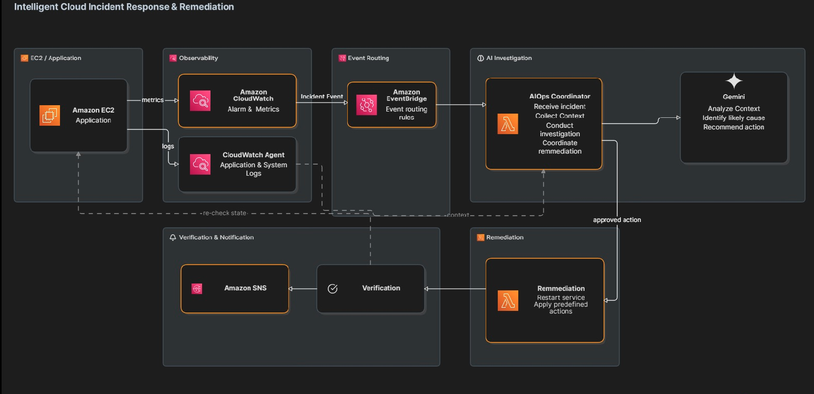

# Building Intelligent Cloud Automation on AWS

Autonomous incident detection and remediation on AWS — a fully event-driven AIOps pipeline that detects a real infrastructure incident, reasons about it with a large language model, enforces a safety policy, and remediates without human intervention. A scheduled Analytics Engine complements the reactive pipeline by turning each day's metrics and application logs into an AI-written report delivered by email.

---

## Table of Contents

- [Overview](#overview)
- [Architecture](#architecture)
- [How It Works](#how-it-works)
- [Daily Report Pipeline](#daily-report-pipeline)
- [Repository Layout](#repository-layout)
- [Source Modules](#source-modules)
- [Demo Application](#demo-application)
- [CI/CD Pipeline](#cicd-pipeline)
- [Safety Design](#safety-design)
- [Prerequisites](#prerequisites)
- [1 — Deploy Infrastructure](#1--deploy-infrastructure)
- [2 — Bootstrap EC2](#2--bootstrap-ec2)
- [3 — Configure GitHub Actions](#3--configure-github-actions)
- [4 — First Automated Deployment](#4--first-automated-deployment)
- [5 — Run the Live Demo](#5--run-the-live-demo)
- [Rollback](#rollback)
- [Infrastructure Reference](#infrastructure-reference)

---

## Overview

This project demonstrates a production-grade AIOps pattern on AWS. When a CloudWatch alarm fires, an event-driven pipeline automatically:

1. Collects live EC2 and CloudWatch context
2. Sends that context to Gemini AI for analysis
3. Runs the AI recommendation through an independent safety policy
4. Executes a predefined remediation action via SSM — only if the policy approves
5. Verifies CPU recovery using a fresh CloudWatch datapoint
6. Publishes the outcome to SNS

The AI never executes arbitrary commands. Every remediation action is a hardcoded mapping inside the Lambda. The policy independently verifies all safety conditions regardless of what the AI returns.

In parallel, a scheduled **Analytics Engine** runs every night at 00:00 UTC: it aggregates the last 24 hours of CloudWatch metrics and application logs, has Gemini interpret the verified numbers, and publishes a daily report to a separate SNS topic.

---

## Architecture



### Incident Response Pipeline

```
┌─────────────────────────────────────────────────────────────────────────────┐
│                         INCIDENT DETECTION & RESPONSE                        │
└─────────────────────────────────────────────────────────────────────────────┘

                      CloudWatch Alarm (CPU > 70%)
                                  │
                                  │ state → ALARM
                                  ▼
                          EventBridge Rule
                                  │
                                  │ invoke
                                  ▼
                      ┌─────────────────────────┐
                      │   Coordinator Lambda    │
                      │   (aiops-coordinator)   │
                      └─────────────────────────┘
                                  │
        ┌─────────────────────────┼─────────────────────────┐
        │                         │                         │
        ▼                         ▼                         ▼
┌───────────────┐      ┌──────────────────┐      ┌─────────────────┐
│ Investigation │      │   Gemini AI      │      │ Policy Engine   │
│               │      │   Analysis       │      │ (independent    │
│ • EC2 State   │      │                  │      │  safety gate)   │
│ • Health      │──────▶ analyzeIncident  │──────▶                 │
│ • CPU Metric  │      │                  │      │ • Verify action │
│               │      │ gemini-3.5-      │      │ • Check state   │
│ collectContext│      │ flash-lite       │      │ • Check health  │
└───────────────┘      └──────────────────┘      │ • Verify CPU    │
                                                  └─────────────────┘
                                                          │
                                   ┌──────────────────────┤
                                   │                      │
                              APPROVED                REJECTED
                                   │                      │
                                   ▼                      ▼
                       ┌────────────────────┐      Log decision
                       │ executeRemediation │      (no action)
                       │                    │
                       │ SSM Run Command    │
                       │ • Send command     │
                       │ • Poll completion  │
                       │ • Verify recovery  │
                       └────────────────────┘
                                   │
                                   ▼
                         EC2 (aiops-demo-app)
                         systemctl restart
                                   │
                                   ▼
                    Wait for fresh CloudWatch datapoint
                                   │
                        ┌──────────┴──────────┐
                        │                     │
                   CPU ≤ 70%             CPU > 70%
                        │                     │
                        ▼                     ▼
                    RESOLVED          REMEDIATION_FAILED
                        │                     │
                        └──────────┬──────────┘
                                   ▼
                          SNS Notification
                           (aiops-incidents)
```

### Analytics & Reporting Pipeline

```
┌─────────────────────────────────────────────────────────────────────────────┐
│                      DAILY ANALYTICS & REPORTING                             │
└─────────────────────────────────────────────────────────────────────────────┘

                    EventBridge Schedule
                    (cron: 0 0 * * ? *)
                    Daily at 00:00 UTC
                              │
                              ▼
                  ┌───────────────────────┐
                  │  Analytics Lambda     │
                  │  (aiops-analytics)    │
                  └───────────────────────┘
                              │
              ┌───────────────┴───────────────┐
              │                               │
              ▼                               ▼
  ┌────────────────────┐        ┌─────────────────────┐
  │  collectMetrics    │        │  aggregateLogs      │
  │                    │        │                     │
  │  CloudWatch        │        │  CloudWatch Logs    │
  │  • CPU (CWAgent)   │        │  Insights Query     │
  │  • Memory          │        │                     │
  │  • Disk            │        │  • Total requests   │
  │  • Network         │        │  • Error rates      │
  │                    │        │  • Response times   │
  │  Last 24 hours     │        │  • Top endpoints    │
  └────────────────────┘        │  • Top errors       │
                                └─────────────────────┘
              │                               │
              └───────────────┬───────────────┘
                              │
                              ▼
                  Verified Statistics Object
                              │
                              ▼
                  ┌───────────────────────┐
                  │  analyzeDailyReport   │
                  │                       │
                  │  Gemini AI interprets │
                  │  pre-calculated data  │
                  │                       │
                  │  • Summary            │
                  │  • Trends             │
                  │  • Anomalies          │
                  │  • Issues             │
                  │  • Recommendations    │
                  └───────────────────────┘
                              │
                              ▼
                      formatReport
                      (stats + insights)
                              │
                              ▼
                     SNS Notification
                      (aiops-reports)
```

### CI/CD Pipeline

```
┌─────────────────────────────────────────────────────────────────────────────┐
│                    CONTINUOUS DEPLOYMENT PIPELINE                            │
└─────────────────────────────────────────────────────────────────────────────┘

              Push to main (demo-app/**)
                          │
                          ▼
                  GitHub Actions
                  • npm ci
                  • npm test
                  • npm run build
                          │
                          ▼
              Package: aiops-demo-app.tgz
                          │
                          ▼
              AWS OIDC Authentication
       (AIOpsDemoAppDeploymentRole)
                          │
                          ▼
              S3 Bucket (immutable)
         releases/<sha>/aiops-demo-app.tgz
                          │
                          ▼
              SSM Run Command → EC2
                          │
      ┌───────────────────┼───────────────────┐
      │                   │                   │
      ▼                   ▼                   ▼
  Download          Install deps      Atomic symlink
  from S3           npm ci            /opt/.../current
                                              │
                                              ▼
                                   systemctl restart
                                              │
                                              ▼
                                   Readiness probe
                                   Health check
                                   Version verify
                                              │
                            ┌─────────────────┴─────────────────┐
                            │                                   │
                         SUCCESS                             FAILURE
                            │                                   │
                     Deployment                          Rollback to
                      complete                          previous release
```

### Key Integration Points

Both CI/CD and AIOps reach EC2 through SSM, but for completely different purposes:

| Component             | Path                                            | Purpose                          | Frequency          |
| --------------------- | ----------------------------------------------- | -------------------------------- | ------------------ |
| **CI/CD**             | GitHub Actions → S3 → SSM → EC2                 | Deploy application releases      | On code push       |
| **Incident Response** | CloudWatch → EventBridge → Lambda → SSM → EC2   | Remediate incidents autonomously | On alarm trigger   |
| **Analytics**         | EventBridge Schedule → Lambda → CloudWatch APIs | Collect and report metrics       | Daily at 00:00 UTC |

---

## How It Works

### 1. Detection

A CloudWatch alarm (`AIOps-Test-HighCPU`) monitors `CPUUtilization` on the demo EC2 instance. When the 5-minute average exceeds 70%, the alarm transitions to `ALARM` and EventBridge immediately invokes the Coordinator Lambda.

### 2. Investigation

The Coordinator calls `collectIncidentContext`, which queries:

- **EC2 API** — instance state, instance type, health status, AZ, IP addresses
- **CloudWatch** — latest CPU utilization datapoint (10-minute window)

This context is passed to the AI and the policy. The AI never has direct AWS access.

### 3. AI Analysis

`analyzeIncident` sends the incident context to **Gemini 3.5 Flash Lite** (`gemini-3.5-flash-lite`) with a strict prompt. The model returns a structured JSON recommendation:

```json
{
  "severity": "HIGH",
  "diagnosis": "CPU saturation detected",
  "confidence": 0.95,
  "recommendedAction": "restart_application",
  "reason": "Healthy instance with sustained high CPU",
  "requiresApproval": false
}
```

The response is validated — only `restart_application` and `no_action` are accepted as actions.

### 4. Policy Evaluation

`evaluateRecommendation` is the authoritative, deterministic safety gate. It re-verifies the evidence itself and never trusts the model's self-assessment — AI `confidence` and `requiresApproval` are **advisory only** and play no role in the decision.

| #   | Condition (checked in order)                                     | Failure outcome |
| --- | ---------------------------------------------------------------- | --------------- |
| 1   | Action is on the allow-list (`restart_application`, `no_action`) | `REJECTED`      |
| 2   | `instanceState === "running"`                                    | `REJECTED`      |
| 3   | `healthStatus === "ok"`                                          | `REJECTED`      |
| 4   | `cpuUtilization > 70` (fresh CloudWatch datapoint)               | `REJECTED`      |

`no_action` is always approved and skips remediation. When a restart is requested, all four conditions must pass for the policy to return `APPROVED` — otherwise it returns `REJECTED`. The policy never returns `APPROVAL_REQUIRED`.

### 5. Remediation

`executeRemediation` uses a hardcoded command map — Gemini never supplies shell commands:

```
restart_application  →  systemctl restart aiops-demo-app
```

The flow:

1. `ssm:SendCommand` targets the specific EC2 instance from the trusted alarm event
2. `ssm:GetCommandInvocation` polls until the command reaches a terminal state (max 120 s)
3. If the command fails, returns `REMEDIATION_FAILED` immediately

### 6. Verification

After a successful SSM command, the verifier polls CloudWatch every 30 seconds (up to 6 minutes) waiting for a **fresh datapoint** — one whose timestamp is strictly after the remediation started. This prevents a stale pre-remediation CPU reading from being mistaken for recovery.

```
SSM command succeeds
        ↓
Poll CloudWatch every 30 s (max 360 s)
        ↓
Fresh datapoint received?
        ├── CPU ≤ 70%  →  RESOLVED
        └── CPU > 70%  →  REMEDIATION_FAILED
```

### 7. Notification

The Coordinator publishes to the `aiops-incidents` SNS topic, which has an email subscription:

| Outcome              | Subject                                                          |
| -------------------- | ---------------------------------------------------------------- |
| `RESOLVED`           | `AIOps Incident Resolved`                                        |
| `REMEDIATION_FAILED` | `AIOps Incident Escalated` with `ENGINEER_INTERVENTION_REQUIRED` |

Email bodies contain only pipeline-verified facts — instance, action, CPU before/after, and status — never the AI's narrative. If the policy **rejects** the AI recommendation, remediation is skipped and no email is sent; the decision is recorded in CloudWatch Logs.

> Both SNS topics require a one-time email confirmation. AWS sends a **"Confirm subscription"** message to each address after the first deploy — reports and incident emails are not delivered until it is confirmed.

---

## Daily Report Pipeline

A second, scheduled pipeline turns daily operations data into an AI-written report.

```
EventBridge Schedule (cron 0 0 * * ? * — 00:00 UTC daily)
        ↓
Analytics Lambda (aiops-analytics, 300 s timeout)
        ↓
Deterministic aggregation of the last 24 hours:
  • collectMetrics — CloudWatch metrics (CPU, memory, disk, network)
  • aggregateLogs  — CloudWatch Logs Insights over the app log group
        ↓
Gemini AI (analyzeDailyReport) — insights only, numbers are pre-calculated
        ↓
formatReport — verified statistics + AI insights
  (summary, performance trends, anomalies, top issues, recommendations)
        ↓
SNS aiops-reports → daily report email
```

The design principles mirror the incident pipeline:

- Metrics and logs are collected deterministically before any AI involvement
- The model never recalculates numbers — it only interprets verified statistics
- The reports topic (`aiops-reports`) is separate from incidents (`aiops-incidents`)

To generate a report on demand:

```bash
aws lambda invoke --function-name aiops-analytics /dev/null
```

---

## Repository Layout

```
aiops-aws/
├── .github/
│   └── workflows/
│       └── deploy-demo-app.yml     # CI/CD pipeline
├── demo-app/                       # Demo workload (Node.js / Express)
│   ├── src/
│   │   ├── routes/
│   │   │   ├── health.routes.ts    # /health/live, /health/ready
│   │   │   └── system.routes.ts    # /api/system, /internal/simulate/cpu
│   │   ├── services/
│   │   │   └── cpu.service.ts      # CPU simulation worker threads
│   │   ├── app.ts
│   │   └── server.ts
│   ├── aiops-demo-app.service      # systemd unit for EC2
│   └── scripts/
│       └── ec2-setup.sh            # One-time EC2 bootstrap
├── docs/
│   └── ARCHITECTURE.png            # Architecture diagram
├── events/
│   └── cloudwatch-alarm.json       # Sample EventBridge payload
├── src/                            # AIOps Lambda source
│   ├── coordinator/
│   │   └── app.ts                  # Lambda handler — orchestrates the pipeline
│   ├── investigation/
│   │   └── collectContext.ts       # EC2 + CloudWatch context collection
│   ├── ai/
│   │   └── analyzeIncident.ts      # Gemini AI integration
│   ├── policy/
│   │   ├── evaluateRecommendation.ts       # Safety policy engine
│   │   └── evaluateRecommendation.test.ts  # 15 policy unit tests
│   └── remediation/
│       └── executeRemediation.ts   # SSM execution + CPU verification
├── template.yaml                   # SAM infrastructure definition
├── samconfig.toml                  # SAM deploy defaults
├── package.json
└── tsconfig.json
```

---

## Source Modules

### `src/coordinator/app.ts`

The Lambda entry point. Receives the EventBridge alarm event, extracts the affected instance ID, and orchestrates the full pipeline in sequence: investigate → analyse → evaluate → remediate → notify. Remediation is only called when `policyDecision.decision === "APPROVED"`.

### `src/investigation/collectContext.ts`

Queries EC2 (`DescribeInstances`, `DescribeInstanceStatus`) and CloudWatch (`GetMetricStatistics`) to build an `IncidentContext` object. This is the only source of truth for instance state — the AI receives this context but cannot query AWS directly.

### `src/ai/analyzeIncident.ts`

Sends the incident context to Gemini 3.5 Flash Lite (`gemini-3.5-flash-lite`) using `application/json` response mode. Validates the response structure and rejects any recommendation with an unsupported action, out-of-range confidence, or missing fields.

### `src/policy/evaluateRecommendation.ts`

The authoritative safety gate. Independently verifies, in order: the action is allow-listed, the instance is running, the instance is healthy, and a fresh CloudWatch datapoint still exceeds the CPU threshold. AI `confidence` and `requiresApproval` are advisory only — they never influence the decision. Returns `APPROVED` or `REJECTED` with a reason.

**Covered by 15 comprehensive unit tests:**

- Approval scenarios (5 tests) — validates all passing conditions
- AI advisory flags (3 tests) — confirms confidence/requiresApproval don't override policy
- Rejection scenarios (7 tests) — unsupported action, wrong state, unhealthy, low CPU

### `src/remediation/executeRemediation.ts`

Executes the remediation via SSM using a hardcoded command map, polls for completion, then waits for a fresh post-remediation CloudWatch datapoint to confirm CPU recovery. Returns `RESOLVED`, `REMEDIATION_FAILED`, or `SKIPPED`.

### `src/analytics/dailyReport.ts`

The Analytics Engine entry point. Triggered nightly by EventBridge, it aggregates the last 24 hours of CloudWatch system metrics (`collectMetrics`) and application request logs (`aggregateLogs`, via CloudWatch Logs Insights), passes the verified statistics to Gemini for interpretation, formats the combined report, and publishes it to the `aiops-reports` SNS topic.

### `src/ai/analyzeDailyReport.ts`

Sends the pre-calculated daily statistics to Gemini (`gemini-3.5-flash-lite`). The prompt forbids recalculating numbers — the model only provides a summary, performance trends, anomalies, top issues, and recommendations as structured JSON.

---

## Demo Application

The demo workload is a Node.js / Express application (`aiops-demo-app`) running as a systemd service on EC2. It exposes:

| Endpoint                                   | Description                                  |
| ------------------------------------------ | -------------------------------------------- |
| `GET /`                                    | Dashboard — shows version, uptime, live CPU  |
| `GET /health`                              | Liveness probe                               |
| `GET /health/ready`                        | Readiness probe                              |
| `GET /api/system`                          | JSON — version, uptime, CPU/memory           |
| `GET /api/system/cpu`                      | JSON — CPU sample and core count             |
| `POST /internal/simulate/cpu?duration=<s>` | Start CPU simulation (requires Bearer token) |
| `POST /internal/simulate/cpu/stop`         | Stop CPU simulation (requires Bearer token)  |

The CPU simulation spawns worker threads to generate real CPU load, which triggers the CloudWatch alarm and drives the AIOps workflow.

All HTTP requests are logged as structured JSON to `/var/log/aiops-demo-app/app.log` (5xx responses also to `error.log`) by a request-logging middleware. The CloudWatch Agent ships these files to the `/aiops/demo-app/application` and `/aiops/demo-app/errors` log groups, where the daily Analytics Engine aggregates them.

---

## CI/CD Pipeline

`.github/workflows/deploy-demo-app.yml` runs on every push to `demo-app/` on `main`, and supports manual redeploy of any previous release by SHA.

```
push to main (demo-app/**)
        ↓
npm ci → npm test → npm run build
        ↓
tar artifact → S3 (releases/<sha>/aiops-demo-app.tgz)
        ↓
SSM Run Command → EC2
        ↓
atomic symlink swap (current → releases/<sha>)
        ↓
systemctl restart aiops-demo-app
        ↓
readiness probe + version verification
        ↓
automatic rollback on failure
```

Authentication uses GitHub Actions OIDC — no long-lived AWS credentials are stored. The deployment role (`AIOpsDemoAppDeploymentRole`) is scoped to the specific repository and branch.

---

## Safety Design

The system is designed so that no single component can cause unintended remediation.

**The AI cannot:**

- Execute AWS API calls
- Supply shell commands
- Override the safety policy
- Approve its own recommendation

**The policy independently verifies:**

- Instance is in `running` state
- Instance health status is `ok`
- CPU utilization exceeds the alarm threshold (70%)
- AI confidence is at least 0.90
- AI has not flagged the recommendation for human review

**SSM permissions are scoped to:**

- A single document: `AWS-RunShellScript`
- A single instance: the stack-managed EC2 resource

**The command map is hardcoded:**

```typescript
const REMEDIATION_COMMANDS = {
  restart_application: "systemctl restart aiops-demo-app",
};
```

Any action not in this map throws immediately. The AI recommendation is used only to select a key from this map.

**Verification requires a fresh datapoint:**
The incident is only marked `RESOLVED` when CloudWatch returns a CPU datapoint with a timestamp strictly after the remediation started. Stale pre-remediation data cannot produce a false positive.

---

## Prerequisites

### Required Tools

- **AWS CLI** — configured for your AWS account, region `us-east-1`
- **AWS SAM CLI** — for infrastructure deployment
- **Node.js 22** — for building the demo application
- **jq** — for JSON processing in deployment scripts

### AWS Resources

- **S3 Bucket** — for immutable deployment artifacts

  ```bash
  aws s3 mb s3://aiops-demo-deploy-$(aws sts get-caller-identity --query Account --output text)
  ```

- **GitHub OIDC Provider** — for CI/CD authentication (if using GitHub Actions)

  ```bash
  aws iam create-open-id-connect-provider \
    --url https://token.actions.githubusercontent.com \
    --client-id-list sts.amazonaws.com \
    --thumbprint-list 6938fd4d98bab03faadb97b34396831e3780aea1
  ```

- **GitHub Deployment Role** — create `AIOpsDemoAppDeploymentRole` with trust policy:

  ```json
  {
    "Version": "2012-10-17",
    "Statement": [
      {
        "Effect": "Allow",
        "Principal": {
          "Federated": "arn:aws:iam::<ACCOUNT_ID>:oidc-provider/token.actions.githubusercontent.com"
        },
        "Action": "sts:AssumeRoleWithWebIdentity",
        "Condition": {
          "StringEquals": {
            "token.actions.githubusercontent.com:aud": "sts.amazonaws.com"
          },
          "StringLike": {
            "token.actions.githubusercontent.com:sub": "repo:<GITHUB_ORG>/<GITHUB_REPO>:ref:refs/heads/main"
          }
        }
      }
    ]
  }
  ```

  Attach policies:
  - `AmazonS3FullAccess` (scoped to deployment bucket)
  - `AmazonSSMFullAccess` (scoped to target EC2 instance)

### API Keys

- **Gemini API Key** — from [Google AI Studio](https://aistudio.google.com/apikey)
  - Free tier: 15 requests per minute
  - Required model: `gemini-3.5-flash-lite`

---

## 1 — Deploy Infrastructure

```bash
sam build
sam deploy \
  --parameter-overrides \
    "GeminiApiKey=<your-key> \
     ReportsEmailAddress=<you@example.com> \
     IncidentEmailAddress=<you@example.com>"
```

`DeploymentBucketName` has a default of `aiops-demo-deploy-<account-id>` — override it only if you use a different bucket. `ReportsEmailAddress` and `IncidentEmailAddress` are required.

SAM creates and manages:

| Resource                                | Description                                                   |
| --------------------------------------- | ------------------------------------------------------------- |
| `AIOpsEC2`                              | EC2 instance running the demo workload                        |
| `AIOpsEC2SecurityGroup`                 | Security group for the instance                               |
| `AIOpsEC2InstanceRole`                  | IAM role with SSM, S3 read, and CloudWatch Agent write access |
| `AIOpsHighCPUAlarm`                     | CloudWatch alarm — CPU > 70% for 5 minutes                    |
| `ApplicationLogGroup` / `ErrorLogGroup` | Log groups for app/error logs (30-day retention)              |
| `IncidentTopic`                         | SNS topic `aiops-incidents` with email subscription           |
| `CoordinatorFunction`                   | AIOps Coordinator Lambda (540 s timeout)                      |
| `IncidentEventRule`                     | EventBridge rule — routes ALARM events to the Coordinator     |
| `AnalyticsFunction`                     | AIOps Analytics Engine Lambda (300 s timeout)                 |
| `ReportsTopic`                          | SNS topic `aiops-reports` with email subscription             |
| `DailyReportSchedule`                   | EventBridge schedule — Analytics Lambda daily at 00:00 UTC    |

After deployment, retrieve the instance ID:

```bash
aws cloudformation describe-stacks \
  --stack-name aiops-mvp \
  --query "Stacks[0].Outputs[?OutputKey=='AIOpsEC2'].OutputValue" \
  --output text
```

---

## 2 — Bootstrap EC2

Run once after the first `sam deploy` to install the application and its dependencies on the instance:

```bash
INSTANCE_ID=$(aws cloudformation describe-stacks \
  --stack-name aiops-mvp \
  --query "Stacks[0].Outputs[?OutputKey=='AIOpsEC2'].OutputValue" \
  --output text)

aws ssm send-command \
  --document-name AWS-RunShellScript \
  --instance-ids "$INSTANCE_ID" \
  --parameters "commands=[\"bash -s\"]" \
  --comment "Bootstrap aiops-demo-app" \
  < demo-app/scripts/ec2-setup.sh
```

Then set the secret control token used to authenticate the CPU simulation endpoint:

```bash
aws ssm send-command \
  --document-name AWS-RunShellScript \
  --instance-ids "$INSTANCE_ID" \
  --parameters 'commands=["sed -i s/change-me/<strong-token>/ /opt/aiops-demo-app/config/production.env"]'
```

> **CloudWatch Agent requirement:** the daily report pipeline depends on the CloudWatch Agent shipping `/var/log/aiops-demo-app/app.log` and `error.log` to the `/aiops/demo-app/application` and `/aiops/demo-app/errors` log groups. The instance role already grants `CloudWatchAgentServerPolicy`; make sure the AMI used for `AmiId` has the agent installed and configured (or extend `ec2-setup.sh` to install it). Without it, the log-derived sections of the daily report will be empty.

#### CloudWatch Agent Configuration

Create `/opt/aws/amazon-cloudwatch-agent/etc/amazon-cloudwatch-agent.json` on the EC2 instance:

```json
{
  "agent": {
    "metrics_collection_interval": 60,
    "run_as_user": "cwagent"
  },
  "logs": {
    "logs_collected": {
      "files": {
        "collect_list": [
          {
            "file_path": "/var/log/aiops-demo-app/app.log",
            "log_group_name": "/aiops/demo-app/application",
            "log_stream_name": "{instance_id}",
            "retention_in_days": 30
          },
          {
            "file_path": "/var/log/aiops-demo-app/error.log",
            "log_group_name": "/aiops/demo-app/errors",
            "log_stream_name": "{instance_id}",
            "retention_in_days": 30
          }
        ]
      }
    }
  },
  "metrics": {
    "namespace": "CWAgent",
    "metrics_collected": {
      "cpu": {
        "measurement": [
          {
            "name": "cpu_usage_active",
            "rename": "cpu_usage_active",
            "unit": "Percent"
          }
        ],
        "metrics_collection_interval": 60,
        "totalcpu": false
      },
      "disk": {
        "measurement": [
          {
            "name": "used_percent",
            "rename": "disk_used_percent",
            "unit": "Percent"
          }
        ],
        "metrics_collection_interval": 60,
        "resources": ["*"]
      },
      "mem": {
        "measurement": [
          {
            "name": "mem_used_percent",
            "rename": "mem_used_percent",
            "unit": "Percent"
          }
        ],
        "metrics_collection_interval": 60
      },
      "net": {
        "measurement": [
          {
            "name": "bytes_sent",
            "rename": "net_bytes_sent",
            "unit": "Bytes"
          },
          {
            "name": "bytes_recv",
            "rename": "net_bytes_recv",
            "unit": "Bytes"
          }
        ],
        "metrics_collection_interval": 60,
        "resources": ["ens5"]
      }
    }
  }
}
```

Start the agent:

```bash
sudo /opt/aws/amazon-cloudwatch-agent/bin/amazon-cloudwatch-agent-ctl \
  -a fetch-config \
  -m ec2 \
  -s \
  -c file:/opt/aws/amazon-cloudwatch-agent/etc/amazon-cloudwatch-agent.json
```

> **Note:** The analytics code expects specific metric names (`cpu_usage_active`, `mem_used_percent`, `disk_used_percent`) and dimensions (device: `nvme0n1p1`, interface: `ens5`). Adjust `collectMetrics.ts` if your instance uses different device names.

---

## 3 — Configure GitHub Actions

In your GitHub repository → **Settings → Environments → production**, add the following variables:

| Variable            | Value                            |
| ------------------- | -------------------------------- |
| `AWS_ACCOUNT_ID`    | Your 12-digit AWS account ID     |
| `AWS_REGION`        | `us-east-1`                      |
| `DEPLOYMENT_BUCKET` | `aiops-demo-deploy-<account-id>` |
| `EC2_INSTANCE_ID`   | Instance ID from SAM outputs     |

No secrets are required — authentication uses OIDC.

---

## 4 — First Automated Deployment

Push any change to `demo-app/` on `main`, or trigger the workflow manually from the Actions tab. The pipeline will build, test, package, upload to S3, and deploy to EC2 via SSM.

The application will be live at:

```
http://<ec2-public-ip>:3000
```

---

## 5 — Run the Live Demo

**Step 1 — Confirm the baseline**

Open `http://<ec2-public-ip>:3000`. Note the version (7-character commit SHA) and confirm CPU is low.

**Step 2 — Trigger the incident**

```bash
curl -X POST "http://<ec2-public-ip>:3000/internal/simulate/cpu?duration=360" \
  -H "Authorization: Bearer <control-token>"
```

The application UI will show CPU climbing. CloudWatch uses 5-minute evaluation periods, so the alarm will fire approximately 5–10 minutes after CPU exceeds 70%.

**Step 3 — Watch the pipeline run**

```
CloudWatch alarm → ALARM
        ↓
EventBridge invokes Coordinator Lambda
        ↓
Investigation: EC2 state + CPU collected
        ↓
Gemini AI: diagnosis + confidence + recommended action
        ↓
Policy: APPROVED (all safety checks pass)
        ↓
SSM: systemctl restart aiops-demo-app
        ↓
Verification: fresh CloudWatch datapoint confirms CPU recovery
        ↓
SNS: AIOps Incident Resolved
```

Monitor progress in CloudWatch Logs → log group `/aws/lambda/aiops-coordinator`.

**Step 4 — Confirm resolution**

The application dashboard will show the service is active and CPU has returned to baseline. The CPU simulation is terminated by the service restart.

**Step 5 — Deploy a new release**

Push a code change to `demo-app/` on `main`. GitHub Actions will build and deploy it. Refresh the dashboard — the version SHA will update.

---

## Rollback

Every release is stored immutably in S3 under `releases/<sha>/aiops-demo-app.tgz`. To redeploy a previous release, trigger the workflow manually from the Actions tab and enter the target SHA in the `release_sha` input.

The deployment script performs an atomic symlink swap and automatically rolls back to the previous release if the readiness probe fails.

---

## Infrastructure Reference

### Lambda timeout

The Coordinator Lambda is configured with a **540-second timeout** to accommodate the full worst-case workflow:

| Stage                        | Max duration |
| ---------------------------- | ------------ |
| Investigation + AI analysis  | ~10 s        |
| SSM command poll             | 120 s        |
| CloudWatch verification poll | 360 s        |
| **Total**                    | **~490 s**   |

### CloudWatch alarm settings

| Setting                | Value                    |
| ---------------------- | ------------------------ |
| Metric                 | `AWS/EC2 CPUUtilization` |
| Statistic              | Average                  |
| Period                 | 300 s (5 minutes)        |
| Evaluation periods     | 1                        |
| Threshold              | > 70%                    |
| Missing data treatment | `notBreaching`           |

### Analytics Engine

| Setting        | Value                                                                      |
| -------------- | -------------------------------------------------------------------------- |
| Function name  | `aiops-analytics`                                                          |
| Timeout        | 300 s                                                                      |
| Schedule       | `cron(0 0 * * ? *)` — 00:00 UTC daily                                      |
| Log sources    | `/aiops/demo-app/application`, `/aiops/demo-app/errors` (30-day retention) |
| Metrics window | Last 24 hours                                                              |

### IAM permissions (Analytics Lambda)

| Permission                                                  | Resource scope                             |
| ----------------------------------------------------------- | ------------------------------------------ |
| `cloudwatch:GetMetricStatistics`                            | `*` (read-only, no resource ARN supported) |
| `logs:StartQuery`, `logs:GetQueryResults`, `logs:StopQuery` | The two application log group ARNs         |
| `sns:Publish`                                               | Specific `ReportsTopic` ARN                |

### IAM permissions (Coordinator Lambda)

| Permission                                            | Resource scope                                  |
| ----------------------------------------------------- | ----------------------------------------------- |
| `ec2:DescribeInstances`, `ec2:DescribeInstanceStatus` | `*` (read-only, no resource ARN supported)      |
| `cloudwatch:GetMetricStatistics`                      | `*` (read-only, no resource ARN supported)      |
| `ssm:SendCommand`                                     | Specific document + specific EC2 instance       |
| `ssm:GetCommandInvocation`                            | `*` (command invocation ARNs are not scopeable) |
| `sns:Publish`                                         | Specific `IncidentTopic` ARN                    |
